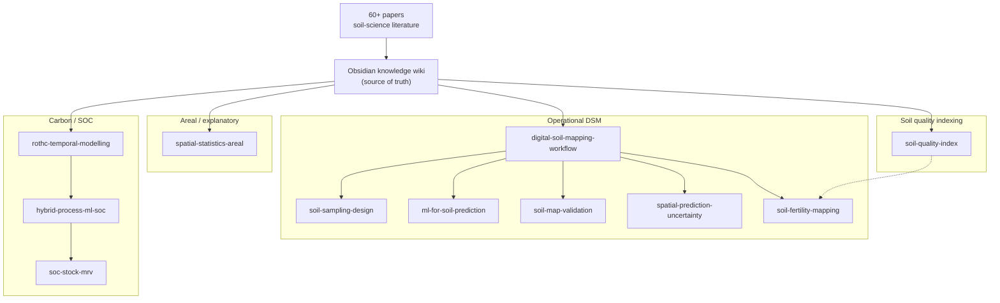

# soil-dsm-skills

[](./plugins/dsm-soil/.claude-plugin/plugin.json)
[](./LICENSE)


> **Portable Claude Code skills for Digital Soil Mapping** — expert soil-mapping know-how, distilled from the literature into an installable plugin.

Eleven skills that give Claude Code working knowledge of **digital soil mapping and soil assessment**: sampling design, ML modelling, prediction uncertainty, map validation, soil quality & health indexing, fertility indices, soil-organic-carbon accounting, and spatial statistics on areal data. Each is **forged from a knowledge wiki** built out of **60+ peer-reviewed papers** — so the guidance tracks the literature, not guesswork. Install once, use in any project, carry it across machines.

Distributed as a **Claude Code plugin** (`dsm-soil`) via this repo, which doubles as a **plugin marketplace**.

## Research-affiliated positioning

`soil-dsm-skills` is a **research-affiliated tool**: it is tied to the project's curated DSM
knowledge wiki, literature corpus, and open-source method packages—not to an institutional
endorsement. Rather than acting as a generic soil-science assistant, it turns that research base
into operational guidance and makes unresolved or underimplemented methods visible instead of
presenting them as solved.

| Gap signalled by the project corpus | What this tool contributes | Current status |
|---|---|---|
| **Correlated Monte-Carlo uncertainty propagation into a derived fertility or soil-quality class** | A workflow that carries per-property uncertainty, spatial error autocorrelation, and cross-property correlation through the index/classification, then reports class probability and entropy inside the area of applicability | Guidance available in [`soil-fertility-mapping`](./plugins/dsm-soil/skills/soil-fertility-mapping/SKILL.md) and [`spatial-prediction-uncertainty`](./plugins/dsm-soil/skills/spatial-prediction-uncertainty/SKILL.md); a complete national worked example remains an explicit research gap |
| **Alternative SQI construction and defensible validation** | Sigmoidal scoring, weight-free area aggregation, network-analysis MDS, recipe sensitivity, fidelity to the full indicator set, external validation, and stability checks | Method guidance available in [`soil-quality-index`](./plugins/dsm-soil/skills/soil-quality-index/SKILL.md); executable package coverage is still evolving, and the corpus reports no head-to-head comparison across all weighting families |
| **Uncertainty-aware composite soil indices** | A concrete route from point-valued SQI/SFI outputs to uncertainty distributions and decision-class probabilities | The method is specified, but the corpus contains no completed worked uncertainty-aware SQI example; this tool marks that boundary explicitly rather than claiming closure |
| **Saturation-aware and hybrid SOC modelling** | RothC limitations are made explicit and paired with a process-model + ML research direction, including possible saturation constraints | Research direction documented in [`rothc-temporal-modelling`](./plugins/dsm-soil/skills/rothc-temporal-modelling/SKILL.md) and [`hybrid-process-ml-soc`](./plugins/dsm-soil/skills/hybrid-process-ml-soc/SKILL.md); not claimed as a solved production method |

These statuses describe the evidence encoded in the current built skills. The full wiki and paper
corpus are the source of truth and are not distributed in this repository, so this positioning is a
traceable project-corpus claim—not an independent systematic-review claim.

## How the skills connect

From raw literature to installable skills — and how the eleven relate:



## The skills (11)

**🗺️ Operational DSM** — end-to-end mapping, from sampling to a finished map with uncertainty:

| Skill | What it does |
|---|---|
| `digital-soil-mapping-workflow` | End-to-end DSM project workflow (scorpan → sampling → model → mapped uncertainty) |
| `soil-sampling-design` | Choose a sampling design by objective (cLHS-family, maxvol, DL, Reference Area, cost, space-time) + runnable R toolkits (`soilsampling`, `MLSampling`) |
| `ml-for-soil-prediction` | Choose/tune/validate ML for soil (no universal winner; feature engineering; interpretability) |
| `soil-map-validation` | CV strategy, accuracy metrics, honest uncertainty, aggregation |
| `spatial-prediction-uncertainty` | Per-pixel intervals + area-of-applicability (AOA/LPD/DI) via CAST; Monte-Carlo to class |
| `soil-fertility-mapping` | Multi-property fertility maps → Soil Fertility Index with two-axis uncertainty; runnable SQI (`soilquality`: PCA-MDS, AHP, scoring) |

**🌱 Carbon / SOC** — soil-organic-carbon over time, and carbon accounting:

| Skill | What it does |
|---|---|
| `rothc-temporal-modelling` | Set up / calibrate / validate RothC over time |
| `hybrid-process-ml-soc` | Fuse RothC + ML for space-time SOC (POML) |
| `soc-stock-mrv` | SOC-stock MRV & carbon crediting |

**🧪 Soil quality indexing** — turning many indicators into one defensible statement of soil condition:

| Skill | What it does |
|---|---|
| `soil-quality-index` | Build and validate an SQI/SHI: minimum-data-set selection (PCA · network analysis · expert opinion), indicator scoring (linear / non-linear / optimum), weighting and aggregation (weighted-additive · **weight-free area method**), and validation that proves the index actually discriminates. Covers land-use and management comparison, degradation quantification, balanced fertilisation, **SEM** for soil health and its drivers, fuzzy association rules, and the ML + remote-sensing route to indicators |

**📐 Areal / explanatory** — association and spillover across polygons, not prediction of a surface:

| Skill | What it does |
|---|---|
| `spatial-statistics-areal` | Moran's I, LISA/BiLISA hot spots and outliers, Lee's L, spatial-weights robustness, Rao's-score (ex-LM) diagnostics, and SLX/SAR/SEM/SDM/SDEM with direct/indirect/total impacts — **R (`spdep`/`spatialreg`) and Python (`libpysal`/`esda`/`spreg`)**, both pipelines execution-verified and cross-checked |

> `soil-quality-index` is built on a full-factorial comparison of the SQI recipe (24 indices from one dataset), so it ranks which choices actually matter — and it carries the traps that cost real projects, including the measured collapse from R² 0.90 to 0.23 when an index is computed from predicted properties instead of predicted directly.

> Several skills go beyond guidance to **runnable R toolkits** — the open-source [`soilsampling`](https://github.com/ccarbajal16/soilsampling), [`MLSampling`](https://github.com/ccarbajal16/MLSampling), and [`soilquality`](https://github.com/ccarbajal16/soilquality) packages — so a design or index becomes concrete, reproducible code. `spatial-statistics-areal` ships an end-to-end `spdep`/`spatialreg` pipeline that was **checked by execution**, a parallel PySAL pipeline verified the same way, an R↔Python equivalence table, and a table of API traps that silently break real scripts.

## Install (recommended: plugin + marketplace)

On any machine with Claude Code, add this repo as a marketplace, then install the plugin:

```
/plugin marketplace add ccarbajal16/soil-dsm-skills
/plugin install dsm-soil
```

Then run `/reload-plugins` to activate it in the current session.

## Update an installed copy

You do **not** need to reinstall. Refresh the marketplace listing, then reload:

```
/plugin marketplace update soil-dsm-skills
/reload-plugins
```

Or from the menu: `/plugin` → **Marketplaces** → select `soil-dsm-skills` → update.

**Want it automatic?** Third-party marketplaces have auto-update **off** by default (only Anthropic's
official marketplaces default to on). Turn it on once and forget it: `/plugin` → **Marketplaces** →
select `soil-dsm-skills` → **Enable auto-update**. Claude Code then refreshes in the background shortly
after startup and prompts you to run `/reload-plugins`.

> Updates are released by version. Claude Code only offers a new version when the `version` field in
> `plugins/dsm-soil/.claude-plugin/plugin.json` is bumped — which `release.ps1` does on every release.

If skills still don't appear after updating, clear the plugin cache, restart Claude Code and reinstall:
`rm -rf ~/.claude/plugins/cache`

Uninstall cleanly from the same `/plugin` menu.

## Install (fallback: no plugin system)

Copies the skills into your personal `~/.claude/skills/` folder (global on this machine):

- Windows (PowerShell): `powershell -ExecutionPolicy Bypass -File install.ps1`
- Git Bash / macOS / Linux: `bash install.sh`

## Building & releasing

The skills are **compiled from an Obsidian knowledge wiki** (the source of truth) into the self-contained files in this repo. Everything below is only for the **author who rebuilds** them — if you're just using the plugin, you can stop here.

<details>
<summary><b>How the skills are built, configured, and released</b></summary>

### How the skills are built (self-contained)

The **source of truth is the Obsidian wiki** (`Soil_skill/skills-forge/<name>/SKILL.md`), where each skill is richly cross-linked with `[[wiki links]]` to concept/method/source pages. Those links don't resolve outside the vault, so `build.ps1`:

1. reads each vault `SKILL.md`,
2. **flattens** every `[[target|alias]]` → `alias` and `[[a/b/c]]` → `c`, leaving clean readable text,
3. writes a **self-contained** `SKILL.md` into `plugins/dsm-soil/skills/<name>/`.

So: **edit in the vault → build → commit → push.** The vault keeps the full linked knowledge base; this repo ships the portable, standalone skills. Nothing updates automatically — adding papers to the vault changes the skills only when you deliberately re-forge them and release.

### Pointing the build at your vault

The build scripts look for the vault's `skills-forge/` folder, in this order:

1. the **`DSM_VAULT`** environment variable, if set (absolute path to your `skills-forge` folder);
2. otherwise, a **sibling `Soil_skill/skills-forge/`** next to this repo — i.e. the repo and the vault share a parent folder.

If your vault lives elsewhere, set `DSM_VAULT` once and the scripts pick it up:

```
# Windows (PowerShell), current session:
$env:DSM_VAULT = 'D:\path\to\your-vault\skills-forge'

# Git Bash / macOS / Linux, current session:
export DSM_VAULT="/d/path/to/your-vault/skills-forge"
```

(Only the skill author needs this — it's for **rebuilding**. People who just install the plugin never touch the vault.)

### Release in one command

`release.ps1` does the whole publish flow:

```
build from the vault → guard the manifests → bump version → commit → push → tag → GitHub release
```

```
# preview only — no writes, no commit, no push, no tag:
powershell -ExecutionPolicy Bypass -File release.ps1 -DryRun

# patch release (0.1.0 -> 0.1.1):
powershell -ExecutionPolicy Bypass -File release.ps1 -Message "add sampling papers"

# minor / major / explicit version:
powershell -ExecutionPolicy Bypass -File release.ps1 -Bump minor
powershell -ExecutionPolicy Bypass -File release.ps1 -Version 1.0.0

# release notes from a file (otherwise gh --generate-notes):
powershell -ExecutionPolicy Bypass -File release.ps1 -NotesFile notes.md
```

It skips cleanly if nothing changed since the last release. After it pushes, installed copies update
with `/plugin marketplace update soil-dsm-skills` + `/reload-plugins` (see
[Update an installed copy](#update-an-installed-copy)).

#### The manifest guard

Manifests are the only thing a user reads **before** installing, so a stale description reaches
everyone. Before committing anything, the script checks:

1. every skill declared in `build.ps1` actually compiled — and nothing stale is left in `skills/`;
2. any `"N skills"` claim in `marketplace.json` and `plugin.json` matches the real roster count;
3. if the roster changed since the last tag, **both** manifests were updated too.

A failure prints what is wrong and **exits 1 without committing**. Override with `-Force` only when
you are sure. This exists because v0.4.1 shipped a `marketplace.json` still advertising the previous
roster — the guard turns that silent failure into a loud one.

#### Escape hatches

| Flag | Effect |
|---|---|
| `-DryRun` | preview everything, write nothing |
| `-Force` | release despite a failing manifest guard |
| `-SkipTag` | commit and push, but no tag and no release |
| `-SkipRelease` | tag and push the tag, but no GitHub release |

The script refuses to reuse an existing tag, and falls back gracefully with a printed command if the
`gh` CLI is not installed.

**Manual alternative** (or from Git Bash / macOS / Linux, which has `build.sh` instead of `build.ps1`):

```
powershell -ExecutionPolicy Bypass -File build.ps1     # or: bash build.sh
git add -A && git commit -m "rebuild skills" && git push
```

### Repo layout

```
soil-dsm-skills/
├── .claude-plugin/marketplace.json     # marketplace manifest (lists the plugin)
├── plugins/dsm-soil/
│   ├── .claude-plugin/plugin.json      # plugin manifest
│   └── skills/<name>/SKILL.md          # the 9 self-contained skills (built)
├── build.ps1 / build.sh                # compile skills from the vault (Windows / Unix)
├── release.ps1                         # one-command: build + guard + bump + commit + push + tag + release
├── install.ps1 / install.sh            # manual install fallback
├── LICENSE                             # MIT
└── README.md
```

</details>
