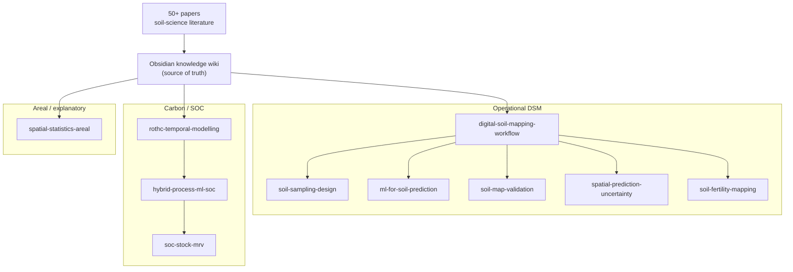

# soil-dsm-skills

[](./plugins/dsm-soil/.claude-plugin/plugin.json)
[](./LICENSE)


> **Portable Claude Code skills for Digital Soil Mapping** — expert soil-mapping know-how, distilled from the literature into an installable plugin.

Ten skills that give Claude Code working knowledge of **digital soil mapping**: sampling design, ML modelling, prediction uncertainty, map validation, fertility indices, soil-organic-carbon accounting, and spatial statistics on areal data. Each is **forged from a knowledge wiki** built out of **50+ peer-reviewed papers** — so the guidance tracks the literature, not guesswork. Install once, use in any project, carry it across machines.

Distributed as a **Claude Code plugin** (`dsm-soil`) via this repo, which doubles as a **plugin marketplace**.

## How the skills connect

From raw literature to installable skills — and how the ten relate:



## The skills (10)

**🗺️ Operational DSM** — end-to-end mapping, from sampling to a finished map with uncertainty:

| Skill | What it does |
|---|---|
| `digital-soil-mapping-workflow` | End-to-end DSM project workflow (scorpan → sampling → model → mapped uncertainty) |
| `soil-sampling-design` | Choose a sampling design by objective (cLHS-family, maxvol, DL, Reference Area, cost, space-time) + runnable R toolkits (`soilsampling`, `MLSampling`) |
| `ml-for-soil-prediction` | Choose/tune/validate ML for soil (no universal winner; feature engineering; interpretability) |
| `soil-map-validation` | CV strategy, accuracy metrics, honest uncertainty, aggregation |
| `spatial-prediction-uncertainty` | Per-pixel intervals + area-of-applicability (AOA/LPD/DI) via CAST; Monte-Carlo to class |
| `soil-fertility-mapping` | Multi-property fertility maps → Soil Fertility Index with two-axis uncertainty; runnable SQI (`soilquality`: PCA-MDS, AHP, scoring) |

**🌱 Carbon / SOC** — soil-organic-carbon over time, and carbon accounting:

| Skill | What it does |
|---|---|
| `rothc-temporal-modelling` | Set up / calibrate / validate RothC over time |
| `hybrid-process-ml-soc` | Fuse RothC + ML for space-time SOC (POML) |
| `soc-stock-mrv` | SOC-stock MRV & carbon crediting |

**📐 Areal / explanatory** — association and spillover across polygons, not prediction of a surface:

| Skill | What it does |
|---|---|
| `spatial-statistics-areal` | Moran's I, LISA/BiLISA hot spots and outliers, Lee's L, spatial-weights robustness, Rao's-score (ex-LM) diagnostics, and SLX/SAR/SEM/SDM/SDEM with direct/indirect/total impacts — **R (`spdep`/`spatialreg`) and Python (`libpysal`/`esda`/`spreg`)**, both pipelines execution-verified and cross-checked |

> Several skills go beyond guidance to **runnable R toolkits** — the open-source [`soilsampling`](https://github.com/ccarbajal16/soilsampling), [`MLSampling`](https://github.com/ccarbajal16/MLSampling), and [`soilquality`](https://github.com/ccarbajal16/soilquality) packages — so a design or index becomes concrete, reproducible code. `spatial-statistics-areal` ships an end-to-end `spdep`/`spatialreg` pipeline that was **checked by execution**, a parallel PySAL pipeline verified the same way, an R↔Python equivalence table, and a table of API traps that silently break real scripts.

## Install (recommended: plugin + marketplace)

On any machine with Claude Code, add this repo as a marketplace, then install the plugin:

```
/plugin marketplace add ccarbajal16/soil-dsm-skills
/plugin install dsm-soil
```

(For a private repo, make sure your Claude Code is authenticated to GitHub.) Update later with a `git push` here, then reinstall/upgrade from the `/plugin` menu. Uninstall cleanly from the same menu.

## Install (fallback: no plugin system)

Copies the skills into your personal `~/.claude/skills/` folder (global on this machine):

- Windows (PowerShell): `powershell -ExecutionPolicy Bypass -File install.ps1`
- Git Bash / macOS / Linux: `bash install.sh`

## Building & releasing

The skills are **compiled from an Obsidian knowledge wiki** (the source of truth) into the self-contained files in this repo. Everything below is only for the **author who rebuilds** them — if you're just using the plugin, you can stop here.

<details>
<summary><b>How the skills are built, configured, and released</b></summary>

### How the skills are built (self-contained)

The **source of truth is the Obsidian wiki** (`Soil_skill/skills-forge/<name>/SKILL.md`), where each skill is richly cross-linked with `[[wiki links]]` to concept/method/source pages. Those links don't resolve outside the vault, so `build.ps1`:

1. reads each vault `SKILL.md`,
2. **flattens** every `[[target|alias]]` → `alias` and `[[a/b/c]]` → `c`, leaving clean readable text,
3. writes a **self-contained** `SKILL.md` into `plugins/dsm-soil/skills/<name>/`.

So: **edit in the vault → build → commit → push.** The vault keeps the full linked knowledge base; this repo ships the portable, standalone skills. Nothing updates automatically — adding papers to the vault changes the skills only when you deliberately re-forge them and release.

### Pointing the build at your vault

The build scripts look for the vault's `skills-forge/` folder, in this order:

1. the **`DSM_VAULT`** environment variable, if set (absolute path to your `skills-forge` folder);
2. otherwise, a **sibling `Soil_skill/skills-forge/`** next to this repo — i.e. the repo and the vault share a parent folder.

If your vault lives elsewhere, set `DSM_VAULT` once and the scripts pick it up:

```
# Windows (PowerShell), current session:
$env:DSM_VAULT = 'D:\path\to\your-vault\skills-forge'

# Git Bash / macOS / Linux, current session:
export DSM_VAULT="/d/path/to/your-vault/skills-forge"
```

(Only the skill author needs this — it's for **rebuilding**. People who just install the plugin never touch the vault.)

### Release in one command

`release.ps1` does the whole publish flow: rebuild from the vault → bump the plugin version → commit → push.

```
# preview only — no writes, no commit, no push:
powershell -ExecutionPolicy Bypass -File release.ps1 -DryRun

# patch release (0.1.0 -> 0.1.1):
powershell -ExecutionPolicy Bypass -File release.ps1 -Message "add sampling papers"

# minor / major / explicit version:
powershell -ExecutionPolicy Bypass -File release.ps1 -Bump minor
powershell -ExecutionPolicy Bypass -File release.ps1 -Version 1.0.0
```

It skips cleanly if nothing changed since the last release. After it pushes, upgrade any installed copies from the `/plugin` menu.

**Manual alternative** (or from Git Bash / macOS / Linux, which has `build.sh` instead of `build.ps1`):

```
powershell -ExecutionPolicy Bypass -File build.ps1     # or: bash build.sh
git add -A && git commit -m "rebuild skills" && git push
```

### Repo layout

```
soil-dsm-skills/
├── .claude-plugin/marketplace.json     # marketplace manifest (lists the plugin)
├── plugins/dsm-soil/
│   ├── .claude-plugin/plugin.json      # plugin manifest
│   └── skills/<name>/SKILL.md          # the 9 self-contained skills (built)
├── build.ps1 / build.sh                # compile skills from the vault (Windows / Unix)
├── release.ps1                         # one-command: build + version bump + commit + push
├── install.ps1 / install.sh            # manual install fallback
├── LICENSE                             # MIT
└── README.md
```

</details>
